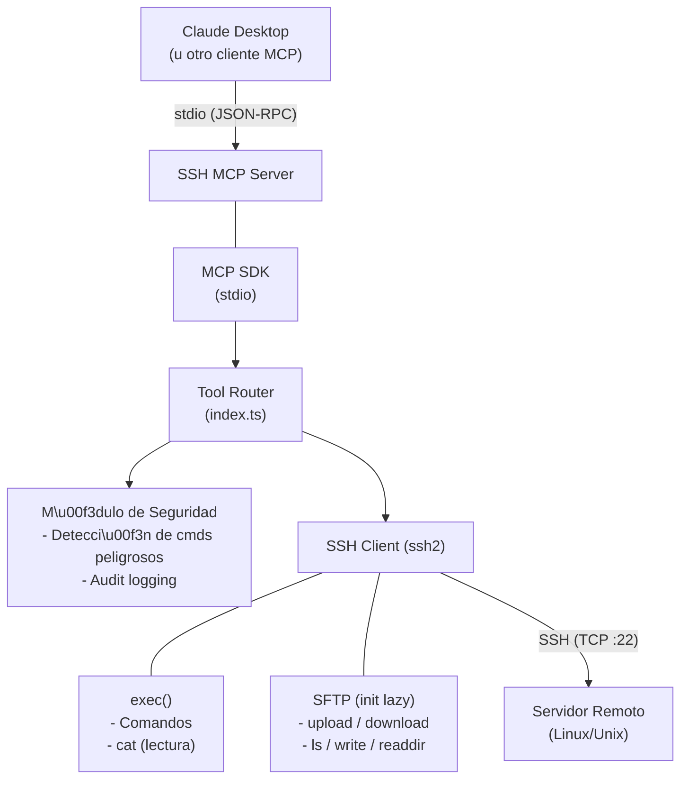
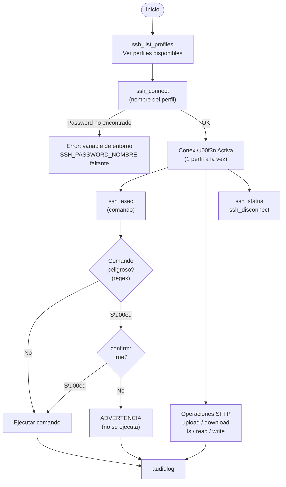
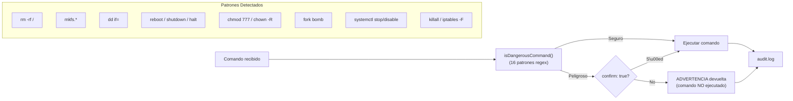

# SSH MCP Server


[Read in English](README.md)

Servidor MCP (Model Context Protocol) para administraci\u00f3n remota de servidores via SSH. Soporta m\u00faltiples perfiles, ejecuci\u00f3n de comandos, transferencia de archivos (SFTP), y detecci\u00f3n de comandos destructivos con audit log.

---

## Arquitectura

### Diagrama General



### Flujo de Conexi\u00f3n y Ejecuci\u00f3n



### Flujo de Seguridad (Comandos Peligrosos)



### Estructura del Proyecto

```text
s01_ssh_mcp/
\u251c\u2500\u2500 src/
\u2502   \u251c\u2500\u2500 index.ts       # Clase SSHMCPServer \u2014 router de tools y l\u00f3gica SSH
\u2502   \u251c\u2500\u2500 tools.ts       # Definici\u00f3n de las 10 tools MCP (schemas JSON)
\u2502   \u251c\u2500\u2500 profiles.ts    # Carga de perfiles + inyecci\u00f3n de passwords desde env
\u2502   \u251c\u2500\u2500 security.ts    # Detecci\u00f3n de comandos peligrosos + AuditLogger
\u2502   \u2514\u2500\u2500 types.ts       # Interfaces: SSHProfile, AuditEntry
\u251c\u2500\u2500 dist/              # Output compilado (generado por tsc)
\u251c\u2500\u2500 profiles.json      # Configuraci\u00f3n de servidores SSH
\u251c\u2500\u2500 .env               # Passwords (no versionado)
\u251c\u2500\u2500 audit.log          # Log de auditor\u00eda (generado en runtime)
\u251c\u2500\u2500 package.json
\u2514\u2500\u2500 tsconfig.json
```

---

## Configuraci\u00f3n

### 1. Perfiles de servidores

Editar `profiles.json`:

```json
{
  "produccion": {
    "host": "192.168.1.100",
    "port": 22,
    "username": "deploy"
  },
  "staging": {
    "host": "192.168.1.101",
    "port": 22,
    "username": "deploy"
  }
}
```

### 2. Passwords

Crear `.env` (copiar de `.env.example`):

```bash
SSH_PASSWORD_PRODUCCION=tu_password
SSH_PASSWORD_STAGING=tu_password
```

El formato es `SSH_PASSWORD_<NOMBRE_PERFIL_UPPERCASE>`.

### 3. Build y ejecuci\u00f3n

```bash
npm install
npm run build
npm start
```

### 4. Configuraci\u00f3n MCP (Claude Desktop)

Agregar en la configuraci\u00f3n de Claude Desktop (`claude_desktop_config.json`):

```json
{
  "mcpServers": {
    "ssh": {
      "command": "node",
      "args": ["/ruta/a/s01_ssh_mcp/dist/index.js"],
      "env": {
        "SSH_PASSWORD_PRODUCCION": "tu_password",
        "SSH_PASSWORD_STAGING": "tu_password"
      }
    }
  }
}
```

> **Nota:** Opcionalmente se puede definir `SSH_PROFILES_PATH` en `env` para apuntar a un `profiles.json` en otra ubicaci\u00f3n.

---

## Tools disponibles

| Tool | Descripci\u00f3n | Requiere conexi\u00f3n |
| ---- | ----------- | :-----------------: |
| `ssh_list_profiles` | Listar perfiles configurados (sin passwords) | No |
| `ssh_connect` | Conectar a un perfil SSH | No |
| `ssh_disconnect` | Cerrar la conexi\u00f3n SSH activa | S\u00ed |
| `ssh_status` | Estado de conexi\u00f3n (perfil, host, uptime) | S\u00ed |
| `ssh_exec` | Ejecutar comando remoto | S\u00ed |
| `ssh_upload` | Subir archivo local al servidor (SFTP) | S\u00ed |
| `ssh_download` | Descargar archivo del servidor (SFTP) | S\u00ed |
| `ssh_ls` | Listar directorio remoto (SFTP) | S\u00ed |
| `ssh_read_file` | Leer contenido de archivo remoto | S\u00ed |
| `ssh_write_file` | Escribir contenido a archivo remoto (SFTP) | S\u00ed |

### Par\u00e1metros por tool

| Tool | Par\u00e1metros | Requeridos |
| ---- | ---------- | :--------: |
| `ssh_connect` | `profile` (string) | S\u00ed |
| `ssh_exec` | `command` (string), `confirm` (boolean) | `command` |
| `ssh_upload` | `localPath` (string), `remotePath` (string) | Ambos |
| `ssh_download` | `remotePath` (string), `localPath` (string) | Ambos |
| `ssh_ls` | `path` (string, default: home) | No |
| `ssh_read_file` | `path` (string) | S\u00ed |
| `ssh_write_file` | `path` (string), `content` (string) | Ambos |

---

## Seguridad

### Detecci\u00f3n de comandos destructivos

Los siguientes patrones son interceptados y requieren `confirm: true` para ejecutarse:

| Patr\u00f3n | Raz\u00f3n |
| ------- | ----- |
| `rm -rf /` | rm recursivo en ra\u00edz del sistema |
| `rm -r`, `rm -rf` | Eliminaci\u00f3n masiva de archivos |
| `mkfs.*` | Formateo de sistema de archivos |
| `dd if=` | Escritura directa a disco |
| `reboot`, `shutdown`, `halt`, `poweroff` | Control de estado del servidor |
| `init 0`, `init 6` | Cambio de runlevel |
| `chmod 777 /` | Permisos inseguros en ra\u00edz |
| `chown -R` | Cambio masivo de propiedad |
| `> /dev/*` | Escritura directa a dispositivo |
| `:(){ :\|:& };:` | Fork bomb |
| `systemctl stop\|disable\|mask` | Detenci\u00f3n de servicios del sistema |
| `killall` | Terminaci\u00f3n masiva de procesos |
| `iptables -F` | Flush de reglas de firewall |

### Audit log

Todas las operaciones se registran en `audit.log` con el formato:

```log
[timestamp] [perfil] [tool] [par\u00e1metros] [RESULT: ok|error]
```

Ejemplo:

```log
[2026-03-04T10:30:00.000Z] [produccion] [ssh_exec] [ls -la /var/log] [RESULT: ok]
[2026-03-04T10:31:00.000Z] [produccion] [ssh_upload] [./app.tar.gz -> /tmp/app.tar.gz] [RESULT: ok]
```

---

## Detalles T\u00e9cnicos

- **Transporte MCP:** stdio (JSON-RPC sobre stdin/stdout)
- **Conexi\u00f3n SSH:** Una conexi\u00f3n activa a la vez. Intentar conectar a otro perfil sin desconectar genera error.
- **SFTP:** Inicializaci\u00f3n lazy \u2014 se crea al primer uso de una operaci\u00f3n de archivos y se reutiliza.
- **Lectura de archivos:** Usa `ssh exec cat` (no SFTP) para archivos de texto.
- **Escritura de archivos:** Usa SFTP `createWriteStream` para soporte de archivos grandes.
- **Escape de argumentos:** Shell escaping con comillas simples para prevenir inyecci\u00f3n de comandos.
- **Audit logging:** No bloqueante \u2014 errores de escritura al log se ignoran para no interrumpir operaciones.
- **Cache de perfiles:** `profiles.json` se lee una vez y se cachea en memoria.

---

## Licencia

Este proyecto est\u00e1 licenciado bajo la [Licencia MIT](LICENSE).
