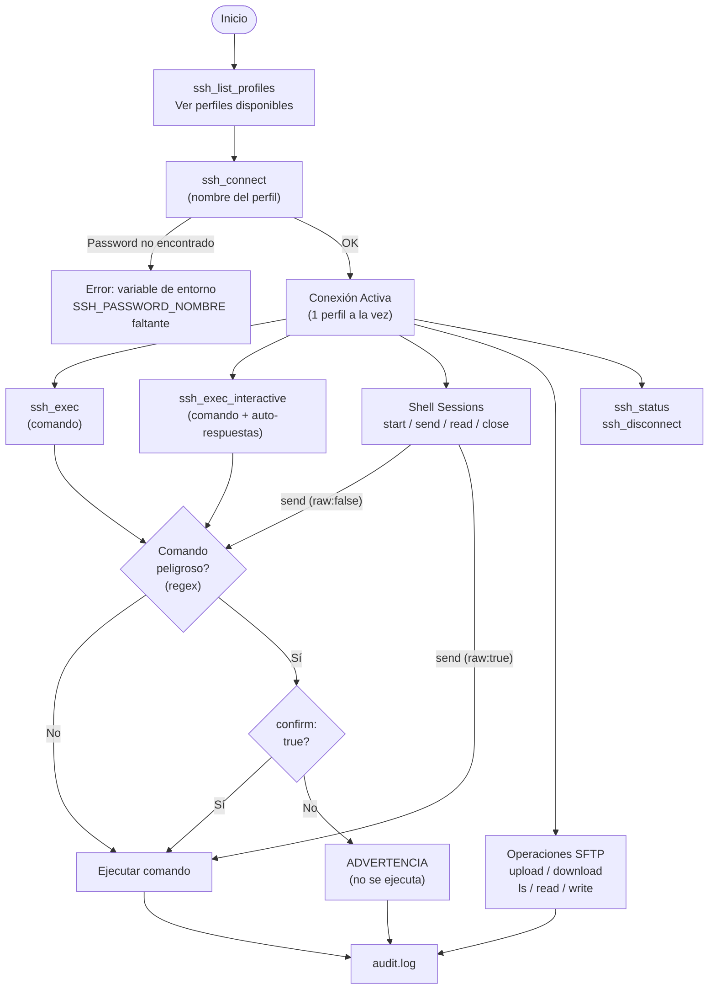
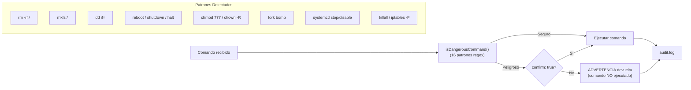

# SSH MCP Server


[](https://www.npmjs.com/package/s01-ssh-mcp)


[Read in English](README.md)

Servidor MCP (Model Context Protocol) para administración remota de servidores via SSH. Soporta múltiples perfiles, ejecución de comandos, comandos interactivos (PTY), sesiones de shell persistentes, transferencia de archivos (SFTP), detección de comandos destructivos con audit log, e historial de operaciones con capacidad de reversión.

---

## Arquitectura

### Diagrama General

```mermaid
graph TB
    Client["Claude Desktop<br/>(u otro cliente MCP)"]
    Server["SSH MCP Server"]
    MCP["MCP SDK<br/>(stdio)"]
    Router["Tool Router<br/>(index.ts)"]
    Security["Módulo de Seguridad<br/>- Detección de cmds peligrosos<br/>- Audit logging"]
    SSH["SSH Client (ssh2)"]
    Exec["exec()<br/>- Comandos<br/>- cat (lectura)"]
    Interactive["exec() + PTY<br/>- Comandos interactivos<br/>- Auto-respuesta a prompts"]
    Shell["shell() + PTY<br/>- Sesiones persistentes<br/>- REPLs / multi-paso"]
    SFTP["SFTP (init lazy)<br/>- upload / download<br/>- ls / write / readdir"]
    Remote["Servidor Remoto<br/>(Linux/Unix)"]

    Client -->|"stdio (JSON-RPC)"| Server
    Server --- MCP
    MCP --> Router
    Router --> Security
    Router --> SSH
    SSH --- Exec
    SSH --- Interactive
    SSH --- Shell
    SSH --- SFTP
    SSH -->|"SSH (TCP :22)"| Remote
```



### Flujo de Conexión y Ejecución



### Flujo de Seguridad (Comandos Peligrosos)



### Estructura del Proyecto

```text
s01_ssh_mcp/
\u251c\u2500\u2500 src/
\u2502   \u251c\u2500\u2500 index.ts       # Clase SSHMCPServer — router de tools, lógica SSH, handlers interactivos/shell
\u2502   \u251c\u2500\u2500 tools.ts       # Definición de las 17 tools MCP (schemas JSON)
\u2502   \u251c\u2500\u2500 profiles.ts    # Carga de perfiles + inyección de passwords desde env
\u2502   \u251c\u2500\u2500 security.ts    # Detección de comandos peligrosos + AuditLogger
\u2502   \u2514\u2500\u2500 types.ts       # Interfaces: SSHProfile, AuditEntry, PromptResponse, ShellSession, CommandRecord, ReverseInfo
\u251c\u2500\u2500 dist/              # Output compilado (generado por tsc)
\u251c\u2500\u2500 profiles.json      # Configuración de servidores SSH
\u251c\u2500\u2500 .env               # Passwords (no versionado)
\u251c\u2500\u2500 audit.log          # Log de auditoría (generado en runtime)
\u251c\u2500\u2500 package.json
\u2514\u2500\u2500 tsconfig.json
```

---

## Configuración

### 1. Perfiles de servidores

Editar `profiles.json`:

```json
{
  "produccion": {
    "host": "192.168.1.100",
    "port": 22,
    "username": "deploy"
  },
  "staging": {
    "host": "192.168.1.101",
    "port": 22,
    "username": "deploy"
  }
}
```

### 2. Passwords

Crear `.env` (copiar de `.env.example`):

```bash
SSH_PASSWORD_PRODUCCION=tu_password
SSH_PASSWORD_STAGING=tu_password
```

El formato es `SSH_PASSWORD_<NOMBRE_PERFIL_UPPERCASE>`.

### 3. Build y ejecución

```bash
npm install
npm run build
npm start
```

### 4. Configuración MCP (Claude Desktop)

**Opción A: Usando npx (recomendado)**

No requiere instalación local — solo agregar en la configuración de Claude Desktop (`claude_desktop_config.json`):

```json
{
  "mcpServers": {
    "ssh": {
      "command": "npx",
      "args": ["-y", "s01-ssh-mcp"],
      "env": {
        "SSH_PASSWORD_PRODUCCION": "tu_password",
        "SSH_PASSWORD_STAGING": "tu_password"
      }
    }
  }
}
```

**Opción B: Instalación local**

```json
{
  "mcpServers": {
    "ssh": {
      "command": "node",
      "args": ["/ruta/a/s01_ssh_mcp/dist/index.js"],
      "env": {
        "SSH_PASSWORD_PRODUCCION": "tu_password",
        "SSH_PASSWORD_STAGING": "tu_password"
      }
    }
  }
}
```

> **Nota:** Opcionalmente se puede definir `SSH_PROFILES_PATH` en `env` para apuntar a un `profiles.json` en otra ubicación.

---

## Tools disponibles

| Tool | Descripción | Requiere conexión |
| ---- | ----------- | :-----------------: |
| `ssh_list_profiles` | Listar perfiles configurados (sin passwords) | No  |
| `ssh_connect` | Conectar a un perfil SSH | No  |
| `ssh_disconnect` | Cerrar la conexión SSH activa (cierra todas las shell sessions) | Sí |
| `ssh_status` | Estado de conexión (perfil, host, uptime) | Sí |
| `ssh_exec` | Ejecutar comando remoto | Sí |
| `ssh_exec_interactive` | Ejecutar comando interactivo con PTY y auto-respuesta a prompts | Sí |
| `ssh_shell_start` | Iniciar sesión de shell interactiva persistente con PTY | Sí |
| `ssh_shell_send` | Enviar input a una sesión de shell activa | Sí |
| `ssh_shell_read` | Leer output acumulado del buffer de una sesión de shell | Sí |
| `ssh_shell_close` | Cerrar una sesión de shell y liberar recursos | Sí |
| `ssh_upload` | Subir archivo local al servidor (SFTP) | Sí |
| `ssh_download` | Descargar archivo del servidor (SFTP) | Sí |
| `ssh_ls` | Listar directorio remoto (SFTP) | Sí |
| `ssh_read_file` | Leer contenido de archivo remoto | Sí |
| `ssh_write_file` | Escribir contenido a archivo remoto (SFTP) | Sí |
| `ssh_history` | Ver historial de operaciones de la conexión activa | Sí |
| `ssh_undo` | Revertir una operación específica por su ID | Sí |

### Parámetros por tool

| Tool | Parámetros | Requeridos |
| ---- | ---------- | :--------: |
| `ssh_connect` | `profile` (string) | Sí |
| `ssh_exec` | `command` (string), `confirm` (boolean) | `command` |
| `ssh_exec_interactive` | `command` (string), `responses[]` ({prompt, answer, sensitive}), `timeout` (number), `confirm` (boolean) | `command` |
| `ssh_shell_start` | `cols` (number, default: 80), `rows` (number, default: 24) | No |
| `ssh_shell_send` | `sessionId` (string), `input` (string), `raw` (boolean), `timeout` (number), `confirm` (boolean) | `sessionId`, `input` |
| `ssh_shell_read` | `sessionId` (string), `timeout` (number) | `sessionId` |
| `ssh_shell_close` | `sessionId` (string) | `sessionId` |
| `ssh_upload` | `localPath` (string), `remotePath` (string) | Ambos |
| `ssh_download` | `remotePath` (string), `localPath` (string) | Ambos |
| `ssh_ls` | `path` (string, default: home) | No |
| `ssh_read_file` | `path` (string) | Sí |
| `ssh_write_file` | `path` (string), `content` (string) | Ambos |
| `ssh_history` | `filter` ("all" \| "reversible" \| "reversed"), `limit` (number) | No |
| `ssh_undo` | `recordId` (number), `confirm` (boolean) | `recordId` |

---

## Historial de Operaciones y Undo

Cada operación ejecutada durante una conexión activa se registra en memoria. Esto permite revisar lo que se hizo y revertir operaciones específicas.

### Reversibilidad por operación

| Operación | Reversible | Estrategia de reversión |
|-----------|:----------:|------------------------|
| `ssh_write_file` | Sí | Restaura contenido previo. Si no existía, elimina el archivo |
| `ssh_upload` | Sí | Restaura contenido previo remoto. Si no existía, elimina el archivo |
| `ssh_download` | Sí | Elimina el archivo local descargado |
| `ssh_exec` | No | Se registra pero no es auto-reversible |
| `ssh_exec_interactive` | No | Se registra pero no es auto-reversible |
| `ssh_read_file` | N/A | Solo lectura, nada que revertir |
| `ssh_ls` | N/A | Solo lectura, nada que revertir |
| `ssh_shell_send` | N/A | No se puede revertir input enviado a un shell interactivo |

El historial se limpia en `ssh_connect` y `ssh_disconnect`.

---

## Seguridad

### Detección de comandos destructivos

Los siguientes patrones son interceptados y requieren `confirm: true` para ejecutarse. Aplica a `ssh_exec`, `ssh_exec_interactive`, y `ssh_shell_send` (cuando `raw: false`):

| Patrón | Razón |
| ------- | ----- |
| `rm -rf /` | rm recursivo en raíz del sistema |
| `rm -r`, `rm -rf` | Eliminación masiva de archivos |
| `mkfs.*` | Formateo de sistema de archivos |
| `dd if=` | Escritura directa a disco |
| `reboot`, `shutdown`, `halt`, `poweroff` | Control de estado del servidor |
| `init 0`, `init 6` | Cambio de runlevel |
| `chmod 777 /` | Permisos inseguros en raíz |
| `chown -R` | Cambio masivo de propiedad |
| `> /dev/*` | Escritura directa a dispositivo |
| `:(){ :\|:& };:` | Fork bomb |
| `systemctl stop\|disable\|mask` | Detención de servicios del sistema |
| `killall` | Terminación masiva de procesos |
| `iptables -F` | Flush de reglas de firewall |

### Audit log

Todas las operaciones se registran en `audit.log` con el formato:

```log
[timestamp] [perfil] [tool] [parámetros] [RESULT: ok|error]
```

Ejemplo:

```log
[2026-03-04T10:30:00.000Z] [produccion] [ssh_exec] [ls -la /var/log] [RESULT: ok]
[2026-03-04T10:31:00.000Z] [produccion] [ssh_upload] [./app.tar.gz -> /tmp/app.tar.gz] [RESULT: ok]
```

---

## Detalles Técnicos

- **Transporte MCP:** stdio (JSON-RPC sobre stdin/stdout)
- **Conexión SSH:** Una conexión activa a la vez. Intentar conectar a otro perfil sin desconectar genera error.
- **SFTP:** Inicialización lazy — se crea al primer uso de una operación de archivos y se reutiliza.
- **Lectura de archivos:** Usa `ssh exec cat` (no SFTP) para archivos de texto.
- **Escritura de archivos:** Usa SFTP `createWriteStream` para soporte de archivos grandes.
- **Escape de argumentos:** Shell escaping con comillas simples para prevenir inyección de comandos.
- **Audit logging:** No bloqueante — errores de escritura al log se ignoran para no interrumpir operaciones.
- **Cache de perfiles:** `profiles.json` se lee una vez y se cachea en memoria.
- **Historial de operaciones:** Todas las operaciones se registran en memoria durante la conexión activa. Las operaciones de archivos (`ssh_write_file`, `ssh_upload`) capturan el contenido previo antes de modificar, permitiendo undo. El historial se limpia al conectar/desconectar.

---

## Licencia

Este proyecto está licenciado bajo la [Licencia MIT](LICENSE).
