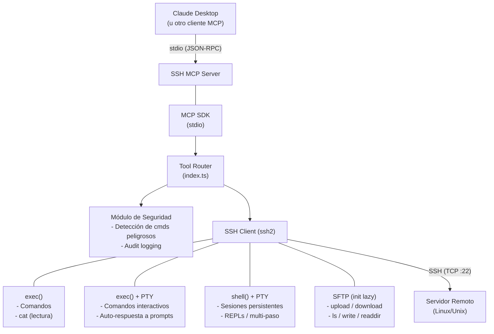
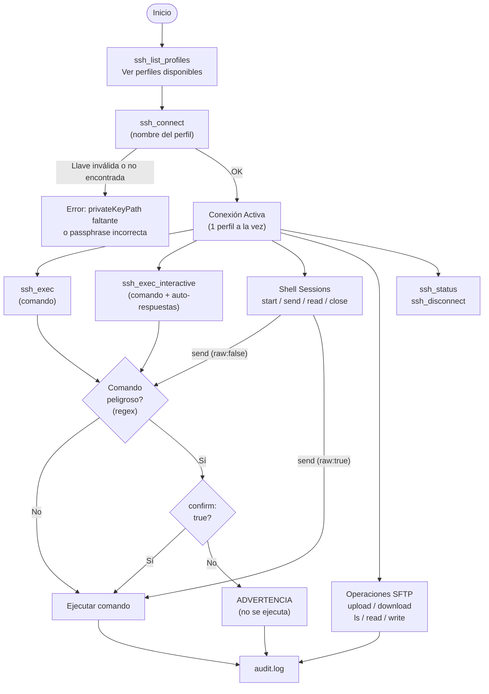
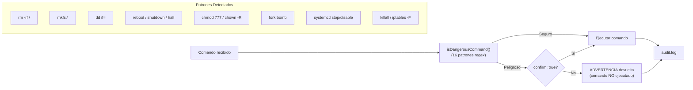

# SSH MCP Server


[](https://www.npmjs.com/package/s01-ssh-mcp)


[Read in English](README.md)

Servidor MCP (Model Context Protocol) para administración remota de servidores via SSH. Soporta múltiples perfiles, ejecución de comandos, comandos interactivos (PTY), sesiones de shell persistentes, transferencia de archivos (SFTP), detección de comandos destructivos con audit log, e historial de operaciones con capacidad de reversión.

---

## Arquitectura

### Diagrama General



### Flujo de Conexión y Ejecución



### Flujo de Seguridad (Comandos Peligrosos)



### Estructura del Proyecto

```text
s01_ssh_mcp/
├── src/
│   ├── index.ts        # Clase SSHMCPServer — router de tools, lógica SSH, handlers interactivos/shell
│   ├── tools.ts        # Definición de las 17 tools MCP (schemas JSON)
│   ├── profiles.ts     # Carga de perfiles + lectura de llave privada desde disco e inyección de passphrase desde env
│   ├── security.ts     # Detección de comandos peligrosos + AuditLogger (redacción de secretos, perms 0o600)
│   ├── types.ts        # Interfaces: SSHProfile, AuditEntry, PromptResponse, ShellSession, CommandRecord, ReverseInfo
│   ├── utils.ts        # Utilidades puras: formatUptime, padRight, escapeShellArg, stripAnsi
│   └── validation.ts   # Validación de inputs: requireString, optionalString/Boolean/Number, clampTimeout
├── dist/               # Output compilado (generado por tsc)
├── profiles.json       # Configuración de servidores SSH (no versionado)
├── profiles.json.example  # Plantilla de perfiles (incluida en el paquete npm)
├── .env                # Passphrases opcionales de llaves (no versionado)
├── audit.log           # Log de auditoría (generado en runtime)
├── package.json
└── tsconfig.json
```

---

## Configuración

### 1. Perfiles de servidores

Copiar `profiles.json.example` → `profiles.json` y ajustar cada campo. El archivo **no debe versionarse** (está en `.gitignore`).

Campos requeridos:

| Campo | Descripción |
|-------|-------------|
| `host` | IP o hostname del servidor |
| `port` | Puerto SSH (normalmente `22`) |
| `username` | Usuario SSH |
| `privateKeyPath` | Ruta a la llave privada. Soporta `~` |
| `hostFingerprint` | Fingerprint SHA-256 del host (ver abajo) |

Campos opcionales:

| Campo | Descripción | Default |
|-------|-------------|---------|
| `localSandboxDir` | Directorio local donde se permiten descargas/uploads. Soporta `~` | Directorio de trabajo del proceso |

```json
{
  "produccion": {
    "host": "192.168.1.100",
    "port": 22,
    "username": "deploy",
    "privateKeyPath": "~/.ssh/id_ed25519_produccion",
    "hostFingerprint": "SHA256:AbCdEfGhIjKlMnOpQrStUvWxYz0123456789abcd",
    "localSandboxDir": "~/descargas-mcp"
  }
}
```

**Obtener el fingerprint del host:**
```bash
ssh-keyscan -t ed25519 HOST 2>/dev/null | ssh-keygen -lf -
# Salida: 256 SHA256:AbCd... host (ED25519)
# Copiar la parte "SHA256:..." al campo hostFingerprint
```

> **Importante:** La autenticación por password fue eliminada. Solo se admite autenticación por llave SSH. Asegúrate de que el servidor remoto tenga la llave pública correspondiente en `~/.ssh/authorized_keys` y que `PasswordAuthentication no` esté configurado en `sshd_config`.

### 2. Passphrases (opcional)

Si tus llaves privadas están protegidas con passphrase, definirlas en `.env`:

```bash
SSH_PASSPHRASE_PRODUCCION=tu_passphrase
SSH_PASSPHRASE_STAGING=tu_passphrase
```

El formato es `SSH_PASSPHRASE_<NOMBRE_PERFIL_UPPERCASE>`. Si la llave no tiene passphrase, omitir la variable.

### 3. Build y ejecución

```bash
npm install
npm run build
npm start
```

### 4. Configuración MCP (Claude Desktop)

**Opción A: Usando npx (recomendado)**

No requiere instalación local — solo agregar en la configuración de Claude Desktop (`claude_desktop_config.json`):

```json
{
  "mcpServers": {
    "ssh": {
      "command": "npx",
      "args": ["-y", "s01-ssh-mcp"],
      "env": {
        "SSH_PASSPHRASE_PRODUCCION": "tu_passphrase_si_aplica",
        "SSH_PASSPHRASE_STAGING": "tu_passphrase_si_aplica"
      }
    }
  }
}
```

**Opción B: Instalación local**

```json
{
  "mcpServers": {
    "ssh": {
      "command": "node",
      "args": ["/ruta/a/s01_ssh_mcp/dist/index.js"],
      "env": {
        "SSH_PASSPHRASE_PRODUCCION": "tu_passphrase_si_aplica",
        "SSH_PASSPHRASE_STAGING": "tu_passphrase_si_aplica"
      }
    }
  }
}
```

> **Nota:** Opcionalmente se puede definir `SSH_PROFILES_PATH` en `env` para apuntar a un `profiles.json` en otra ubicación.

---

## Tools disponibles

| Tool | Descripción | Requiere conexión |
| ---- | ----------- | :-----------------: |
| `ssh_list_profiles` | Listar perfiles configurados (incluye `privateKeyPath`, sin exponer llave ni passphrase) | No  |
| `ssh_connect` | Conectar a un perfil SSH | No  |
| `ssh_disconnect` | Cerrar la conexión SSH activa (cierra todas las shell sessions) | Sí |
| `ssh_status` | Estado de conexión (perfil, host, uptime) | Sí |
| `ssh_exec` | Ejecutar comando remoto | Sí |
| `ssh_exec_interactive` | Ejecutar comando interactivo con PTY y auto-respuesta a prompts | Sí |
| `ssh_shell_start` | Iniciar sesión de shell interactiva persistente con PTY | Sí |
| `ssh_shell_send` | Enviar input a una sesión de shell activa | Sí |
| `ssh_shell_read` | Leer output acumulado del buffer de una sesión de shell | Sí |
| `ssh_shell_close` | Cerrar una sesión de shell y liberar recursos | Sí |
| `ssh_upload` | Subir archivo local al servidor (SFTP) | Sí |
| `ssh_download` | Descargar archivo del servidor (SFTP) | Sí |
| `ssh_ls` | Listar directorio remoto (SFTP) | Sí |
| `ssh_read_file` | Leer contenido de archivo remoto (soporta lectura parcial con offset/limit) | Sí |
| `ssh_write_file` | Escribir contenido a archivo remoto (SFTP) | Sí |
| `ssh_history` | Ver historial de operaciones de la conexión activa | Sí |
| `ssh_undo` | Revertir una operación específica por su ID | Sí |

### Parámetros por tool

| Tool | Parámetros | Requeridos |
| ---- | ---------- | :--------: |
| `ssh_connect` | `profile` (string) | Sí |
| `ssh_exec` | `command` (string), `confirm` (boolean) | `command` |
| `ssh_exec_interactive` | `command` (string), `responses[]` ({prompt, answer, sensitive}), `timeout` (number), `confirm` (boolean) | `command` |
| `ssh_shell_start` | `cols` (number, default: 80), `rows` (number, default: 24) | No |
| `ssh_shell_send` | `sessionId` (string), `input` (string), `raw` (boolean), `timeout` (number), `confirm` (boolean), `sensitive` (boolean) | `sessionId`, `input` |
| `ssh_shell_read` | `sessionId` (string), `timeout` (number) | `sessionId` |
| `ssh_shell_close` | `sessionId` (string) | `sessionId` |
| `ssh_upload` | `localPath` (string), `remotePath` (string) | Ambos |
| `ssh_download` | `remotePath` (string), `localPath` (string) | Ambos |
| `ssh_ls` | `path` (string, default: home) | No |
| `ssh_read_file` | `path` (string), `offset` (number, línea inicial base 1), `limit` (number, máx. líneas) | `path` |
| `ssh_write_file` | `path` (string), `content` (string) | Ambos |
| `ssh_history` | `filter` ("all" \| "reversible" \| "reversed"), `limit` (number) | No |
| `ssh_undo` | `recordId` (number), `confirm` (boolean) | `recordId` |

---

## Historial de Operaciones y Undo

Cada operación ejecutada durante una conexión activa se registra en memoria. Esto permite revisar lo que se hizo y revertir operaciones específicas.

### Reversibilidad por operación

| Operación | Reversible | Estrategia de reversión |
|-----------|:----------:|------------------------|
| `ssh_write_file` | Sí | Restaura contenido previo. Si no existía, elimina el archivo |
| `ssh_upload` | Sí | Restaura contenido previo remoto. Si no existía, elimina el archivo |
| `ssh_download` | Sí | Restaura contenido local previo. Si no existía localmente, elimina el archivo |
| `ssh_exec` | No | Se registra pero no es auto-reversible |
| `ssh_exec_interactive` | No | Se registra pero no es auto-reversible |
| `ssh_read_file` | N/A | Solo lectura, nada que revertir |
| `ssh_ls` | N/A | Solo lectura, nada que revertir |
| `ssh_shell_send` | N/A | No se puede revertir input enviado a un shell interactivo |

El historial se limpia en `ssh_connect` y `ssh_disconnect`.

---

## Seguridad

### Modelo de seguridad

Este servidor implementa **capas de seguridad complementarias**. Es importante entender qué cubre cada una y cuáles son sus límites:

| Capa | Qué protege | Límite |
|------|-------------|--------|
| **Autenticación por llave SSH** | Solo conecta con llave privada configurada | No protege si la llave es robada |
| **Verificación de host (MITM)** | Rechaza servidores que no coincidan con el fingerprint configurado | Requiere configurar `hostFingerprint` correctamente |
| **Sandbox local** | Restringe `ssh_download`/`ssh_upload`/`ssh_undo` a un directorio | No aplica a operaciones remotas |
| **Detección de comandos peligrosos** | Advierte sobre patrones destructivos conocidos | **Capa de aviso, NO de seguridad.** Evadible via obfuscación, variables, `eval`, `raw: true` en shell |
| **Redacción en audit log** | Oculta patrones comunes de secretos en el log | No detecta todos los formatos posibles de secretos |

> **Recomendación de defensa en profundidad:** El servidor solo es tan seguro como el usuario SSH remoto. Configura el usuario con permisos mínimos necesarios, usa `sudoers` restrictivo, y mantén `PasswordAuthentication no` en `sshd_config`.

> **Nota sobre `raw: true` en `ssh_shell_send`:** Este modo envía el input directamente al shell sin ninguna validación de comandos peligrosos. Es intencional para casos de uso avanzados (secuencias de control, REPL internos). Usar con precaución.

### Limitaciones del historial y undo

- El historial y la capacidad de undo **se pierden al reiniciar el servidor MCP** (el historial vive en memoria).
- **Los archivos binarios** (detectados via null bytes) **son excluidos del backup de undo completamente** — el undo es solo UTF-8.
- El undo **no es atómico**: si el proceso muere a mitad de la escritura de restauración, el archivo puede quedar truncado.
- El contenido previo de archivos mayores a 512 KB no se almacena — el undo mostrará error en ese caso.
- El historial mantiene un máximo de 100 entradas. Las más antiguas se descartan automáticamente.

### Caché de perfiles

`profiles.json` se lee una vez al arranque y se cachea en memoria. **Cambios en el archivo requieren reiniciar el servidor MCP** para que surtan efecto.

### Detección de comandos destructivos

Los siguientes patrones son interceptados y requieren `confirm: true` para ejecutarse. Aplica a `ssh_exec`, `ssh_exec_interactive`, y `ssh_shell_send` (cuando `raw: false`):

> **Nota:** Esta detección es una capa de aviso, no una barrera de seguridad. No depender de ella como única protección contra acciones destructivas.

| Patrón | Razón |
| ------- | ----- |
| `rm -rf /` | rm recursivo en raíz del sistema |
| `rm -r`, `rm -rf` | Eliminación masiva de archivos |
| `mkfs.*` | Formateo de sistema de archivos |
| `dd if=` | Escritura directa a disco |
| `reboot`, `shutdown`, `halt`, `poweroff` | Control de estado del servidor |
| `init 0`, `init 6` | Cambio de runlevel |
| `chmod 777 /` | Permisos inseguros en raíz |
| `chown -R` | Cambio masivo de propiedad |
| `> /dev/*` | Escritura directa a dispositivo |
| `:(){ :\|:& };:` | Fork bomb |
| `systemctl stop\|disable\|mask` | Detención de servicios del sistema |
| `killall` | Terminación masiva de procesos |
| `iptables -F` | Flush de reglas de firewall |

### Audit log

Todas las operaciones se registran en `audit.log` con el formato:

```log
[timestamp] [perfil] [tool] [parámetros] [RESULT: ok|error]
```

Ejemplo:

```log
[2026-03-04T10:30:00.000Z] [produccion] [ssh_exec] [ls -la /var/log] [RESULT: ok]
[2026-03-04T10:31:00.000Z] [produccion] [ssh_upload] [./app.tar.gz -> /tmp/app.tar.gz] [RESULT: ok]
```

---

## Detalles Técnicos

- **Transporte MCP:** stdio (JSON-RPC sobre stdin/stdout)
- **Conexión SSH:** Una conexión activa a la vez. Intentar conectar a otro perfil sin desconectar genera error. Keepalive: intervalo 30s, máximo 3 reintentos, timeout de conexión 20s.
- **Verificación de host:** Cada `ssh_connect` verifica el fingerprint remoto con `hostHash: "sha256"` + `hostVerifier`. Convierte el fingerprint hex de ssh2 a base64 y lo compara con el valor `SHA256:<base64>` del perfil. La conexión se rechaza si no coinciden.
- **Limpieza de conexión:** Los eventos `close` y `end` del SSH triggean `cleanupState()` en desconexiones inesperadas, cerrando todas las sesiones y el estado SFTP. Las desconexiones intencionales están protegidas contra doble limpieza.
- **SFTP:** Inicialización lazy — se crea al primer uso y se reutiliza. Se auto-invalida si el subsistema SFTP cierra o genera error (`sftp.on('close'/'error')`).
- **Exec Interactivo:** Usa `exec()` con `pty: true` para comandos que requieren input interactivo. Soporta auto-respuesta a prompts via regex. Los patrones regex del usuario se validan con `safe-regex2` antes de compilar para prevenir ReDoS. Settle timeout (2s) detecta la finalización; timeout global (default 30s) previene bloqueos.
- **Sesiones Shell:** Usa `shell()` con PTY para terminales interactivos persistentes. Máximo 5 sesiones concurrentes. Auto-cierre tras 5 minutos de inactividad. Buffer limitado a 1MB. Todas las sesiones se cierran en `ssh_disconnect`. Los códigos ANSI se eliminan del output.
- **Timeout de exec:** Todas las llamadas internas `ssh exec` corren contra un timeout de 30s. stdout y stderr se truncan a 1MB con truncación per-chunk durante la acumulación. Exit codes no-cero sin stderr resuelven con anotación `[exit code: N]` en vez de rechazar (preserva comportamiento de `grep`/`diff`). Usa `cat -- path` y `rm -f -- path` para proteger contra nombres de archivo que empiecen con `-`.
- **Clamping de timeout:** Los timeouts del usuario se restringen a un mínimo de 1s y máximo de 5 minutos.
- **Validación de inputs:** Centralizada en `validation.ts`. Todos los argumentos de tools pasan por helpers tipados (`requireString`, `optionalBoolean`, etc.).
- **Lectura de archivos:** Usa `ssh exec cat` (no SFTP) para archivos de texto. Soporta lectura parcial via `offset` (línea inicial, base 1) y `limit` (máx. líneas) usando `sed -n`.
- **Escritura de archivos:** Usa SFTP `createWriteStream` para soporte de archivos grandes.
- **Escape de argumentos:** Shell escaping con comillas simples para prevenir inyección de comandos.
- **Audit logging:** No bloqueante. Patrones comunes de secretos (`password=`, `token=`, `Bearer`, etc.) se redactan antes de escribir. Archivo creado con permisos `0o600`. Respuestas con `sensitive: true` se registran como `[REDACTED]`. Todas las operaciones de tools son auditadas, incluyendo `ssh_ls`. Shutdown graceful via handler `beforeExit` para flush de escrituras pendientes. Requiere rotación externa (logrotate) para producción.
- **Cache de perfiles:** `profiles.json` se lee y valida completamente al arranque (todos los campos requeridos + llave legible). Cambios requieren reiniciar el servidor MCP.
- **Historial de operaciones:** Máximo 100 entradas en memoria. `ssh_download` preserva archivos locales pre-existentes via undo tipo `local_file_restore`. Archivos binarios (detección de null bytes) son excluidos del backup de undo. `previousContent` no se almacena si supera 512KB. El historial se limpia al conectar/desconectar.
- **Sandbox local:** `ssh_download`, `ssh_upload` y `ssh_undo` (borrado local) verifican que la ruta resolta esté dentro del `localSandboxDir` del perfil activo.

---

## Licencia

Este proyecto está licenciado bajo la [Licencia MIT](LICENSE).
