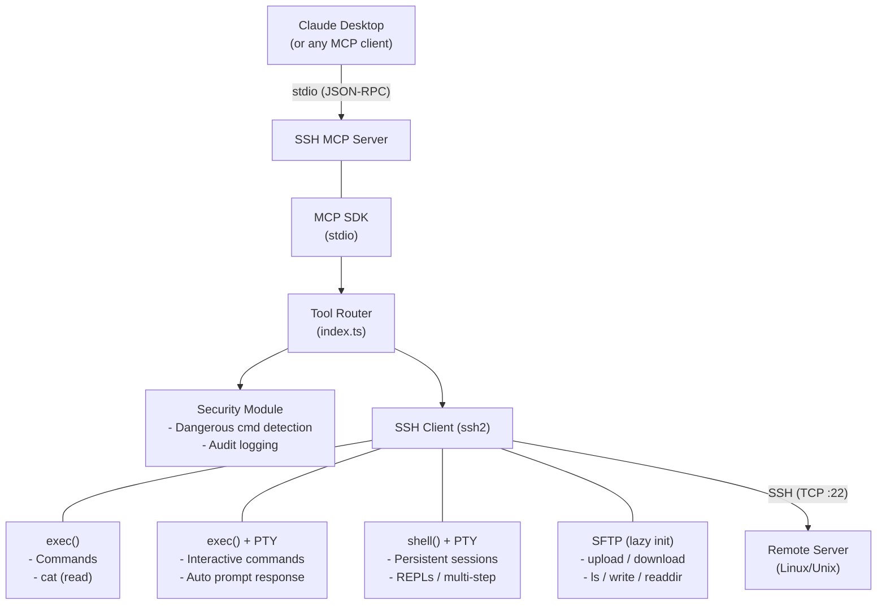
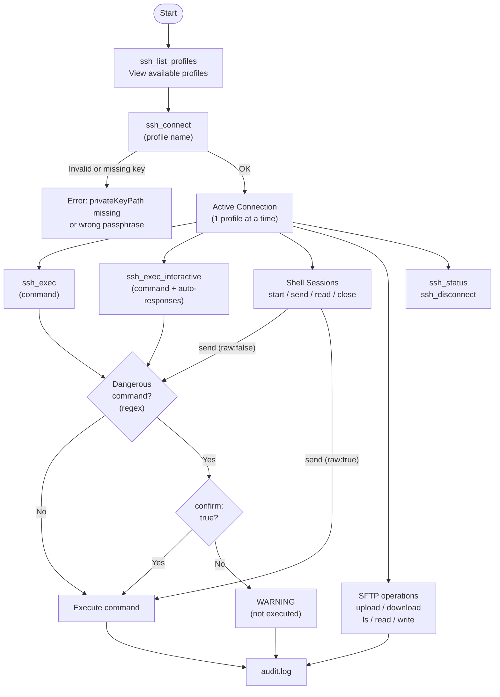
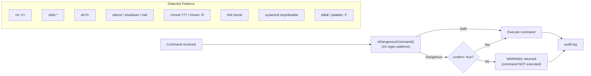

# SSH MCP Server


[](https://www.npmjs.com/package/s01-ssh-mcp)


[Leer en Espa\u00f1ol](README.es.md)

MCP (Model Context Protocol) server for remote server administration via SSH. Supports multiple profiles, remote command execution, interactive commands (PTY), persistent shell sessions, file transfer (SFTP), destructive command detection with audit logging, and operation history with undo capabilities.

---

## Architecture

### General Overview



### Connection and Execution Flow



### Security Flow (Dangerous Commands)



### Project Structure

```text
s01_ssh_mcp/
├── src/
│   ├── index.ts        # SSHMCPServer class — tool router, SSH logic, interactive/shell handlers
│   ├── tools.ts        # MCP tool definitions (17 tools, JSON schemas)
│   ├── profiles.ts     # Profile loading + private key file read and passphrase injection from env
│   ├── security.ts     # Dangerous command detection + AuditLogger (secret redaction, 0o600 perms)
│   ├── types.ts        # Interfaces: SSHProfile, AuditEntry, PromptResponse, ShellSession, CommandRecord, ReverseInfo
│   ├── utils.ts        # Pure utilities: formatUptime, padRight, escapeShellArg, stripAnsi
│   └── validation.ts   # Input validation: requireString, optionalString/Boolean/Number, clampTimeout
├── dist/               # Compiled output (generated by tsc)
├── profiles.json       # SSH server configuration (not versioned)
├── profiles.json.example  # Profile template (included in npm package)
├── .env                # Optional key passphrases (not versioned)
├── audit.log           # Audit log (generated at runtime)
├── package.json
└── tsconfig.json
```

---

## Setup

### 1. Server Profiles

Copy `profiles.json.example` → `profiles.json` and fill in your values. The file **must not be versioned** (it is in `.gitignore`).

Required fields:

| Field | Description |
|-------|-------------|
| `host` | Server IP or hostname |
| `port` | SSH port (usually `22`) |
| `username` | SSH username |
| `privateKeyPath` | Path to the private key file. Supports `~` |
| `hostFingerprint` | SHA-256 host fingerprint (see below) |

Optional fields:

| Field | Description | Default |
|-------|-------------|---------|
| `localSandboxDir` | Local directory where downloads/uploads are allowed. Supports `~` | Process working directory |

```json
{
  "production": {
    "host": "192.168.1.100",
    "port": 22,
    "username": "deploy",
    "privateKeyPath": "~/.ssh/id_ed25519_production",
    "hostFingerprint": "SHA256:AbCdEfGhIjKlMnOpQrStUvWxYz0123456789abcd",
    "localSandboxDir": "~/mcp-downloads"
  }
}
```

**Get the host fingerprint:**
```bash
ssh-keyscan -t ed25519 HOST 2>/dev/null | ssh-keygen -lf -
# Output: 256 SHA256:AbCd... host (ED25519)
# Copy the "SHA256:..." part into hostFingerprint
```

> **Important:** Password authentication has been removed. Only SSH key authentication is supported. Make sure the remote server has the matching public key in `~/.ssh/authorized_keys` and enforce `PasswordAuthentication no` in `sshd_config`.

### 2. Passphrases (optional)

If your private keys are protected with a passphrase, define them in `.env`:

```bash
SSH_PASSPHRASE_PRODUCTION=your_passphrase
SSH_PASSPHRASE_STAGING=your_passphrase
```

Format: `SSH_PASSPHRASE_<PROFILE_NAME_UPPERCASE>`. Omit the variable if the key has no passphrase.

### 3. Build and Run

```bash
npm install
npm run build
npm start
```

### 4. MCP Configuration (Claude Desktop)

**Option A: Using npx (recommended)**

No local installation required — just add to your Claude Desktop config (`claude_desktop_config.json`):

```json
{
  "mcpServers": {
    "ssh": {
      "command": "npx",
      "args": ["-y", "s01-ssh-mcp"],
      "env": {
        "SSH_PASSPHRASE_PRODUCTION": "your_passphrase_if_any",
        "SSH_PASSPHRASE_STAGING": "your_passphrase_if_any"
      }
    }
  }
}
```

**Option B: Local installation**

```json
{
  "mcpServers": {
    "ssh": {
      "command": "node",
      "args": ["/path/to/s01_ssh_mcp/dist/index.js"],
      "env": {
        "SSH_PASSPHRASE_PRODUCTION": "your_passphrase_if_any",
        "SSH_PASSPHRASE_STAGING": "your_passphrase_if_any"
      }
    }
  }
}
```

> **Note:** You can optionally set `SSH_PROFILES_PATH` in `env` to point to a `profiles.json` in a different location.

---

## Available Tools

| Tool | Description | Requires Connection |
| ---- | ----------- | :-----------------: |
| `ssh_list_profiles` | List configured profiles (includes `privateKeyPath` and `hostFingerprint`; never exposes the key or passphrase) | No |
| `ssh_connect` | Connect to an SSH profile | No |
| `ssh_disconnect` | Close the active SSH connection (closes all shell sessions) | Yes |
| `ssh_status` | Connection status (profile, host, uptime) | Yes |
| `ssh_exec` | Execute a remote command | Yes |
| `ssh_exec_interactive` | Execute interactive command with PTY and auto-response to prompts | Yes |
| `ssh_shell_start` | Start a persistent interactive shell session with PTY | Yes |
| `ssh_shell_send` | Send input to an active shell session | Yes |
| `ssh_shell_read` | Read accumulated output from a shell session buffer | Yes |
| `ssh_shell_close` | Close a shell session and release resources | Yes |
| `ssh_upload` | Upload a local file to the server (SFTP) | Yes |
| `ssh_download` | Download a file from the server (SFTP) | Yes |
| `ssh_ls` | List a remote directory (SFTP) | Yes |
| `ssh_read_file` | Read remote file contents | Yes |
| `ssh_write_file` | Write content to a remote file (SFTP) | Yes |
| `ssh_history` | View operation history for the active connection | Yes |
| `ssh_undo` | Revert a specific operation by record ID | Yes |

### Tool Parameters

| Tool | Parameters | Required |
| ---- | ---------- | :------: |
| `ssh_connect` | `profile` (string) | Yes |
| `ssh_exec` | `command` (string), `confirm` (boolean) | `command` |
| `ssh_exec_interactive` | `command` (string), `responses[]` ({prompt, answer, sensitive}), `timeout` (number), `confirm` (boolean) | `command` |
| `ssh_shell_start` | `cols` (number, default: 80), `rows` (number, default: 24) | No |
| `ssh_shell_send` | `sessionId` (string), `input` (string), `raw` (boolean), `timeout` (number), `confirm` (boolean), `sensitive` (boolean) | `sessionId`, `input` |
| `ssh_shell_read` | `sessionId` (string), `timeout` (number) | `sessionId` |
| `ssh_shell_close` | `sessionId` (string) | `sessionId` |
| `ssh_upload` | `localPath` (string), `remotePath` (string) | Both |
| `ssh_download` | `remotePath` (string), `localPath` (string) | Both |
| `ssh_ls` | `path` (string, default: home) | No |
| `ssh_read_file` | `path` (string) | Yes |
| `ssh_write_file` | `path` (string), `content` (string) | Both |
| `ssh_history` | `filter` ("all" \| "reversible" \| "reversed"), `limit` (number) | No |
| `ssh_undo` | `recordId` (number), `confirm` (boolean) | `recordId` |

---

## Operation History & Undo

Every operation executed during an active connection is recorded in memory. This allows reviewing what was done and reverting specific operations.

### Reversibility by Operation

| Operation | Reversible | Undo Strategy |
|-----------|:----------:|---------------|
| `ssh_write_file` | Yes | Restores previous content. If file didn't exist, deletes it |
| `ssh_upload` | Yes | Restores previous remote content. If file didn't exist, deletes it |
| `ssh_download` | Yes | Deletes the downloaded local file |
| `ssh_exec` | No | Recorded but not auto-reversible |
| `ssh_exec_interactive` | No | Recorded but not auto-reversible |
| `ssh_read_file` | N/A | Read-only, nothing to revert |
| `ssh_ls` | N/A | Read-only, nothing to revert |
| `ssh_shell_send` | N/A | Cannot revert input sent to an interactive shell |

The history is cleared on `ssh_connect` and `ssh_disconnect`.

---

## Security

### Security Model

This server implements **layered security**. Each layer has defined boundaries:

| Layer | Protects Against | Limitations |
|-------|-----------------|-------------|
| **SSH key auth** | Password brute-force | Does not protect if the key is stolen |
| **Host verification (MITM)** | Connecting to impersonated servers | Requires correct `hostFingerprint` setup |
| **Local sandbox** | Arbitrary local file read/write/delete via `ssh_download`/`ssh_upload`/`ssh_undo` | Does not apply to remote operations |
| **Dangerous command detection** | Accidental destructive commands | **Advisory layer, NOT a security barrier.** Bypassable via obfuscation, variables, `eval`, or `raw: true` in shell |
| **Audit log redaction** | Common secret patterns (password=, token=, Bearer) in logs | Does not detect all possible secret formats |

> **Defense in depth recommendation:** The server is only as secure as the remote SSH user. Configure the user with minimal necessary permissions, use restrictive `sudoers`, and keep `PasswordAuthentication no` in `sshd_config`.

> **Note on `raw: true` in `ssh_shell_send`:** This mode sends input directly to the shell without any dangerous command validation. This is intentional for advanced use cases (control sequences, internal REPLs). Use with caution.

### History & Undo Limitations

- History and undo capability **are lost when the MCP server restarts** (history lives in memory).
- Undo writes files using UTF-8 encoding. **Not reliable for binary files** (images, certificates, etc.).
- Undo is **not atomic**: if the process dies mid-write during restore, the file may be truncated.
- Previous content of files larger than 512 KB is not stored — undo will return an error in that case.
- History keeps a maximum of 100 entries. Oldest entries are automatically evicted.

### Profile Cache

`profiles.json` is read and validated at server startup. **Changes to the file require restarting the MCP server** to take effect.

### Destructive Command Detection

The following patterns are intercepted and require `confirm: true` to execute. This applies to `ssh_exec`, `ssh_exec_interactive`, and `ssh_shell_send` (when `raw: false`):

> **Note:** This detection is an advisory layer, not a security barrier. Do not rely on it as the sole protection against destructive actions.

| Pattern | Reason |
| ------- | ------ |
| `rm -rf /` | Recursive rm on system root |
| `rm -r`, `rm -rf` | Mass file deletion |
| `mkfs.*` | Filesystem formatting |
| `dd if=` | Direct disk write |
| `reboot`, `shutdown`, `halt`, `poweroff` | Server state control |
| `init 0`, `init 6` | Runlevel change |
| `chmod 777 /` | Insecure permissions on root |
| `chown -R` | Mass ownership change |
| `> /dev/*` | Direct device write |
| `:(){ :\|:& };:` | Fork bomb |
| `systemctl stop\|disable\|mask` | System service shutdown |
| `killall` | Mass process termination |
| `iptables -F` | Firewall rules flush |

### Audit Log

All operations are logged to `audit.log` with the format:

```log
[timestamp] [profile] [tool] [parameters] [RESULT: ok|error]
```

Example:

```log
[2026-03-04T10:30:00.000Z] [production] [ssh_exec] [ls -la /var/log] [RESULT: ok]
[2026-03-04T10:31:00.000Z] [production] [ssh_upload] [./app.tar.gz -> /tmp/app.tar.gz] [RESULT: ok]
```

---

## Technical Details

- **MCP Transport:** stdio (JSON-RPC over stdin/stdout)
- **SSH Connection:** One active connection at a time. Attempting to connect to another profile without disconnecting raises an error. Keepalive: 30s interval, max 3 retries, 20s ready timeout.
- **Host Verification:** Every `ssh_connect` verifies the remote fingerprint via `hostHash: "sha256"` + `hostVerifier`. Converts the hex fingerprint from ssh2 to base64 and compares to the `SHA256:<base64>` value stored in the profile. Connection is rejected if they don't match.
- **Connection Cleanup:** SSH `close` and `end` events trigger `cleanupState()` on unexpected disconnects, clearing all sessions and SFTP state. Intentional disconnects are guarded against double-cleanup.
- **SFTP:** Lazy initialization — created on first file operation use and reused thereafter. Auto-invalidated if the SFTP subsystem closes or errors (`sftp.on('close'/'error')`).
- **Interactive Exec:** Uses `exec()` with `pty: true` for commands requiring interactive input. Supports auto-response to prompts via regex matching. User-provided regex patterns are validated with `safe-regex2` before compilation to prevent ReDoS. Settle timeout (2s) detects command completion; global timeout (default 30s) prevents hangs.
- **Shell Sessions:** Uses `shell()` with PTY for persistent interactive terminals. Up to 5 concurrent sessions stored in a `Map<string, ShellSession>`. Auto-close after 5 minutes of inactivity. Buffer capped at 1MB. All sessions are closed on `ssh_disconnect`. ANSI escape codes are stripped from output.
- **Exec Command Timeout:** All internal `ssh exec` calls (including `cat` for file reads) race against a 30s timeout. stdout output is truncated at 1MB. Uses `cat -- path` and `rm -f -- path` to protect against filenames starting with `-`.
- **Timeout Clamping:** User-provided timeouts for `ssh_exec_interactive`, `ssh_shell_send`, and `ssh_shell_read` are clamped to a minimum of 1s and a maximum of 5 minutes.
- **Input Validation:** Centralized in `validation.ts`. All tool arguments go through typed helpers (`requireString`, `optionalBoolean`, etc.) instead of unchecked `any` casts.
- **File Reading:** Uses `ssh exec cat` (not SFTP) for text files.
- **File Writing:** Uses SFTP `createWriteStream` for large file support.
- **Argument Escaping:** Shell escaping with single quotes to prevent command injection.
- **Audit Logging:** Non-blocking — log write failures are silently ignored to avoid disrupting operations. Common secret patterns (`password=`, `token=`, `Bearer`, etc.) are redacted before writing. Log file created with `0o600` permissions (owner read/write only). Responses marked `sensitive: true` are logged as `[REDACTED]`.
- **Profile Cache:** `profiles.json` is read and fully validated once at startup (all required fields + key file readable). Changes require restarting the MCP server.
- **Operation History:** All operations are recorded in memory during the active connection. File operations (`ssh_write_file`, `ssh_upload`) capture previous content before modifying, enabling undo. History capped at 100 entries. `previousContent` not stored if > 512KB. History is cleared on connect/disconnect.

---

## License

This project is licensed under the [MIT License](LICENSE).
